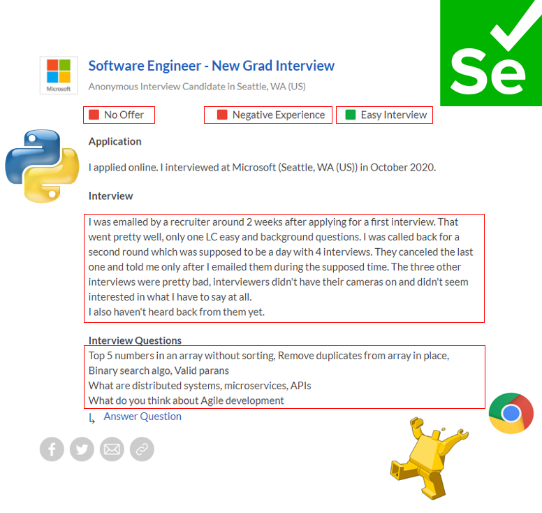
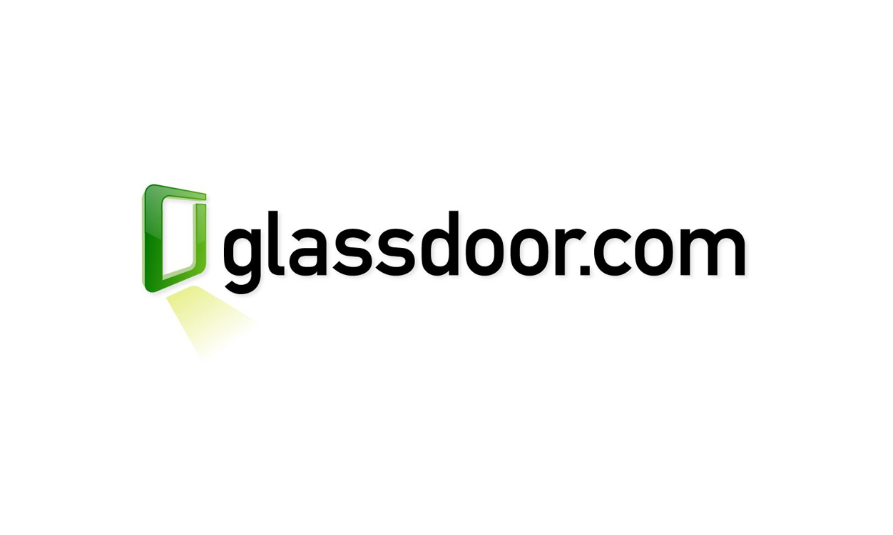

#  Capstone Project : Interview experience sentiment analysis

### John Lim Jian Ann, DSI-17-Singapore

---

## Problem Statement

An efficient hiring process saves a business time and money. Better hiring decisions mean less turnover. However to hire good and qualified candidates or to even attract good candidates for an interview, businesses need to ensure that they have a robust interview and hiring process.

I am a HR consultant and I was approached by a company to review their interview and hiring process. The client wants to give candidates the best interview experience regardless of whether they were accepted for the job. By doing so, they hope to achieve more positive interview reviews, strengthen the company branding and ultimately attract more talent.

The client have consolidated a list of interview feedback from previous interviewees and have requested my team's help to analyse the feedback and find out how can they improve on their current interview process and give candidates the best interview experience.

# 

## Executive Summary

To better improve their company branding and attract quality candidates for job openings, my client decides to improve their hiring process. In order to do so, my client wants to better understand how candidates feel about their interview. Hence they got anonymous feedback from interviewees. My client has then requested my help to analyse the feedback and find out how they can improve on their current interview process and give candidates the best interview experience.

The goal of this project is to help the business identify a positive or negative interview experience as reviewed by the interviewee. By analysing companies with thousands of interview reviews on glassdoor, my team and I have built a model that can analyse the sentiments of a review and provide feedback to the company.

With this model, businesses will be able to tell if a reviewer has a positive or negative interview experience. Businesses can then use the insights to train their HR and hiring managers to adopt or avoid certain attributes during an interview so as to give the candidate the best interview experience.

We want to learn from both positive and negative interview experiences so as to adopt or avoid certain traits of an interview process. As we have a rather imbalanced dataset and want to learn from both experiences, we optimize our model based on the accuracy score and ROC-AUC score.

We have trained several models and optimized our paramters based on accuracy score. Eventually, we decided to go with the logistic regression model due to the high accuracy and ROC-AUC score. It is also one of the model that does not overfit.

On unseen data, our model has a 76.06% accuracy score, 88.95% sensitivity, 62.9% specificity and 81.43% roc-auc score. Our model is able to distinguish between positive and negative sentiments generally well.

From our model, we identified keywords that led to a positive or negative review. In summary, words like friendly, smooth, relaxed, patient, polite, casual, like conversation, prompt, efficient, professional are highly associated to positive sentiments. On the other hand, words like unprofessional, never heard, not friendly, late, condesending, ghosted, disorganized, impersonal, waste time, rushed, cancelled, awkward are highly associated to negative sentiments.

As for the limitations, our model is fitted with sentences that were scrapped from glassdoor only. As such, the model analysis is limited to the corpus of texts obtained. Any words that are new to the corpus will not be considered when doing vectorizing transformation and prediction. Another limitation is that our model is only able to pick up english words. If the review is in another language, our model is not able to accurately predict the sentiment.

Our client can use the model predictions and its findings to train their HR and hiring managers so that they can give interviewee a better interview experience regardless of a job offer at the end. This model is not just subjected to our client but also extended to businesses who have collected feedback from interviewees and want to understand the sentiments and gather insights.

# 

---

## Data dictionary:

|Feature|Type|Description|Values|
|---|---|---|---|
|**offer**|int|Whether interviewee was offered a job|0 : No Offer 1 : Declined Offer 2 : Accepted Offer|
|**experience**|int|overall experience of interview|0 : Negative Experience 1 : Positive Experience|
|**difficulty**|int|interview difficulty|0 : Difficult 1 : Average 2 : Easy|
|**interview**|str|interview review|---|
|**question**|str|interview question|---|
|**source**|str|company that was reviewed|Amazon/Apple/Microsoft/Facebook/Google|
|**length**|int|word count of interview review|---|

---

## Exploratory Data Analysis

Scrapped Apple, Microsoft, Facebook, Google and Amazon glassdoor profiles for interview reviews. Web scrapped with python, selenium and headless chrome.
Scraped offer outcome, interview difficulty, interview review, interview questions and interview experience (label)
# 
Looking at the distribution of reviews, Amazon has the highest number of reviews from candidates. As we look into the types rating for interview experience of each company, we notice that most interview experiences are positive.
# 
As expected, when someone was offered and accepted it, most likely the interview experience was good and hence a high proportion of positive experience is seen under accepted offer.
Interestingly enough, despite no offer or declined offer, both outcomes has high positive experience over negative and neutral experience.
Next, we visualize the difficulty of the interview with respect to the different kind of interview experience. Even for a difficult interview, the number of positive interview experience remains high for these companies.
This means we the interview experience can also be positive if one was not offered the job or if one rejected an offer.
# 
# 
When analysing interview review, we count the length of each reviews and found out that both negative and positive reviews have around the same distribution shape where most of reviews in both classes are around 200 words. That is where you see the peak of both histograms. The reason why the count of negative class is much lower is due to the highly imbalaced class.
# 
Looking at the heatmap, the feature with the highest correlation with interview experience is 'offer'. However the value is not strong and we will proceed to analyse each review to find out more about what gives a positive interview experience and what gives a negative one.Looking at the heatmap, the feature with the highest correlation with interview experience is 'offer'. However the value is not strong and we will proceed to analyse each review to find out more about what gives a positive interview experience and what gives a negative one.
# 
 - Subjective sentences generally refer to personal opinion, emotion or judgment whereas objective refers to factual information.
 - Polarity is float which lies in the range of [-1,1] where 1 means positive statement and -1 means a negative statement
# 
**Word cloud of negative review based on Term frequency - inverse document frequency**
# 
**Word cloud of positivereview based on Term frequency - inverse document frequency**
# 

## Dealing with imbalanced classes
 - We have 21079 positive reviews and 4762 negative reviews
 - To deal with this imbalanced class, we scrapped more data from other company profiles on glassdoor
 - After scrapping additional data, we managed to increase our minority class to 11800.

## Pre-processing Words
# 
Interview reviews are then preprocessed before modelling:
 - Removed all the swear words and flags, emojis, html text etc,
 - Convert all words to lower case
 - Lemmatizing each word
 - Removing words with less than 2 characters

## Model Execution

**Train / Validation Split**
 - Splitted the Supervised data set to 90% - 10% where 90% is used for training the model and 10% is used for supervised testing
 - We tuned the hyperparameters using train set and optimized our results based on accuracy
 - Both count vectorizer and Tfidf vectorizer were used for comparison

**Benchmark model**
 - K Nearest Neighbor model as benchmark

**Model selection**
 - Multinomial Naive Bayes Model
 - Logistic Regression Model
 - Random Forest Classifier Model
 - XGBoost Classifier Model

**Assessment**
 - Test models with Accuracy and ROC-AUC score

| Model| Train's Acc| Val Acc| Score Difference|Sensitivity|Specificity|Validation's ROC_AUC
|----|----|----|----|----|----|----|
| K Nearest Neighbor (Benchmark)|0.7534|0.67609|0.07731|0.9412|0.2025|0.6402
| Multinomial Naive Bayes|0.8243|0.8239|0.0004|0.8833|0.7178|0.8791
| Logistic Regression|0.8337|0.8349|-0.0011|0.9018|0.7152|0.8978
| Random Forest|0.7803|0.785|-0.0046|0.8254|0.7127|0.8487
| XGBoost|0.7298|0.7293|0.0005|0.9957|0.2533|0.8637

Since employers want to find out what are the factors of an interview process that could lead to both a positive and negative interview experience, our model selection is evaluated based on accuracy. Businesses will use our finding to train their HR and hiring managers to avoid factors that lead to negative interview experience and adopt factors that lead to positive interview experience.

The production model will have a accuary and ROC-AUC closest to 1 among all other models. For our optimization parameter, accuracy was selected as we want value both positive and negative sentiment findings. We also based our selection on ROC-AUC score as we do not have a balanced dataset.

We have trained and fitted k nearest neighbor model as benchmark model and multinomial naive bayes, logistic regression, random forest classifier and XGBoost classifier.

Looking at the scores for all models, it appears that top performing model is the Logistic regression model. It out performs the benchmark for both accuracy and ROC-AUC scores. The model does not over fit as the train accuracy does not out weigh the validation accuracy. The closest model to the logistic regression is the multinomial naive bayes. The accuracy and AUC-ROC socre of the logistic regression is very close to the logistic regression model.

---

**Final Model on unseen shopee data**

# 

| Production Model|Result Acc|Sensitivity|Specificity|f1 score|ROC_AUC
|----|---- |----  |---- |----|----|
| Logistic Regression|0.7606|0.8895|0.629|0.7897|0.8143

**Hyperparameters:**
 - max_df = 0.9,
 - max_features = 240000,
 - min_df = 2,
 - ngram_range = (1, 2)
 - C = 10
 - penalty = 'l2'
 - solver = 'liblinear'

# 
---

## Insights and Findings
 
Some example of words highly correlated to negative experience:
Unprofessional, rude, never heard, waste, not friendly, late, condescending, ghosted, disorganized, impersonal, waste time, rushed, cancelled, awkward, reason, wasted, irrelevant
# 

Some example of words highly correlated to positive experience:
Friendly, fun, smooth, relaxed, patient, like conversation, polite, minute long, hangout, casual, professional, receive email, efficient, prompt, straightforward.
# 

**Examples of Negative Shopee Interview Reviews**
- The entire interview process was very disrespectful. They don't ask for your free time and simply give you a time. During the interview, they can be up to 30 minutes late! They don't seem to have much good things to say about the company too. A senior manager said work environment is very stressful. 

- Took less than 10 mins after waiting for more than a half-hour. The recruiter seemed very tired. She was working with her laptop while I introduce myself and didn't even give a glance. She didn't ask any work-relevant questions. 

- Heard back over a month after applying, went through 3 rounds of interviews didn't make it to the last round. Tedious process for an entry-level position. Standard interview questions not too hard. Recruiters were pleasant, hiring manager didn't seem to be interested, felt like they already had an answer. 

- One technical round. The interviewer provided a false link at the beginning. The interviewer does not even know Java and he kept asking how to design a dynamic size array in Java without reallocation. This is utterly disgusting. 

- Phone interview, sent me an email to schedule phone interview. Sent email afterwards to ask why I didn't get the role and if there's anything I can work on. Did not get a reply.

**Examples of Positive Shopee Interview Reviews**
- The recruiter is very nice and she will explain to you how the company views the most for this position. Phone interview is not difficult and then she directly gives me the chance for a 2nd round test interview. The test interview is about 1.5 hrs and the Python&SQL questions are very basic. 

- Phone interview with HR first then direct interview with the cat managers. both interviews were quite fast, within 30 minutes, i think the phone interview was shorter and the hr person was very friendly 

- HR Manager was friendly and provided information before the interview took place. There was a better understanding of the happenings and the overall reputation of the company at present. The questions were as expected (i.e. tell me more about yourself, why are you applying for Shopee, etc. )

## Limitations :

Review : 'They have a very extensive hiring process, I had to go through multiple interviews for an entry-level position. However, the process for my case was fast, the interview intervals happened in the span of a week or immediately the next day.'

 - Actual Sentiment : Positive Experience
 - Model Predicts : Negative Experience

After the model predicted the results, there is still a need for someone to review and validate if certain predictions makes sense. One example is the one above where the reviewer mentioned that the hiring process was extensive and there were multiple rounds, however the process was fast. Perhaps our model picked up more negativity than positivity and as such gave it a negative sentiment as prediction.

As for the limitations, our model is fitted with sentences that were scrapped from glassdoor only. As such, the model analysis is limited to the corpus of texts obtained. Any words that are new to the corpus will not be considered when doing vectorizing transformation and prediction. Another limitation is that our model is only able to pick up english words. If the review is in another language, our model is not able to accurately predict the sentiment. Sarcasm within a review might result in inaccurate prediction.

Our logistic model assumes linear separability between different texts. However, in reality, texts or comments are not exactly linearly separable. At the same time, Naive Bayes model assumes independence between features. Texts or comments may not be independent in fact

Our analysis is limited to the generic positive or negative experience and some of the key words with high coefficients tend to be very subjective and scalable. For instance, nice is the word that has the highest coefficient for positive experience, however it is very subjective and there are too many variations of nice.

## Conclusion
Any company who have collected feedback from interviewees and want to understand the sentiments and gather insights can adopt this model. They will be able to analyse feedback gathered from interviewees, and find out areas that they can improvement on. That will probably help them achieve a higher positive interview experience rating on their public profiles, achieve a better company brand and attract more talent.

---
## Data Sources

Scrapped glassdoor website for dataset.

# 

References :
 - https://www.glassdoor.sg/Interview/Amazon-Interview-Questions-E6036.htm
 - https://www.glassdoor.sg/Interview/Apple-Interview-Questions-E1138.htm
 - https://www.glassdoor.sg/Interview/Google-Interview-Questions-E9079.htm
 - https://www.glassdoor.sg/Interview/Facebook-Interview-Questions-E40772.htm
 - https://www.glassdoor.sg/Interview/Microsoft-Interview-Questions-E1651.htm
 - https://www.glassdoor.sg/Interview/Walmart-Interview-Questions-E715.htm
 - https://www.glassdoor.sg/Interview/Accenture-Interview-Questions-E4138.htm
 - https://www.glassdoor.sg/Interview/Dyson-Interview-Questions-E214340.htm
 - https://www.glassdoor.sg/Interview/Wells-Fargo-Interview-Questions-E8876.htm
 - https://www.glassdoor.sg/Interview/Netflix-Interview-Questions-E11891.htm
 - https://www.glassdoor.sg/Interview/Tesla-Interview-Questions-E43129.htm
 - https://www.glassdoor.sg/Interview/J-P-Morgan-Interview-Questions-E145.htm
 - https://www.glassdoor.sg/Interview/Bloomberg-L-P-Interview-Questions-E3096.htm
 - https://www.glassdoor.sg/Interview/LinkedIn-Interview-Questions-E34865.htm
 - https://www.glassdoor.sg/Interview/eBay-Interview-Questions-E7853.htm
 - https://www.glassdoor.sg/Interview/PayPal-Interview-Questions-E9848.htm
 - https://www.glassdoor.sg/Interview/HubSpot-Interview-Questions-E227605.htm
 - https://www.glassdoor.sg/Interview/DocuSign-Interview-Questions-E307604.htm
 - https://www.glassdoor.sg/Interview/NVIDIA-Interview-Questions-E7633.htm
 - https://www.glassdoor.sg/Interview/Oracle-Interview-Questions-E1737.htm
 - https://www.glassdoor.sg/Interview/Uber-Interview-Questions-E575263.htm
 - https://www.glassdoor.sg/Interview/Twitter-Interview-Questions-E100569.htm
 - https://www.glassdoor.sg/Interview/Lyft-Interview-Questions-E700614.htm
 - https://www.glassdoor.sg/Interview/Pinterest-Interview-Questions-E503467.htm
 - https://www.glassdoor.sg/Interview/Airbnb-Interview-Questions-E391850.htm
 - https://www.glassdoor.sg/Interview/Yelp-Interview-Questions-E43314.htm
 - https://www.glassdoor.sg/Interview/Booking-com-Interview-Questions-E256653.htm
 - https://www.glassdoor.sg/Interview/Groupon-Interview-Questions-E301291.htm
 - https://www.glassdoor.sg/Interview/TikTok-Interview-Questions-E2230881.htm
 - https://www.glassdoor.sg/Interview/ByteDance-Interview-Questions-E1624196.htm
 - https://www.glassdoor.sg/Interview/Shopee-Interview-Questions-E1263091.htm